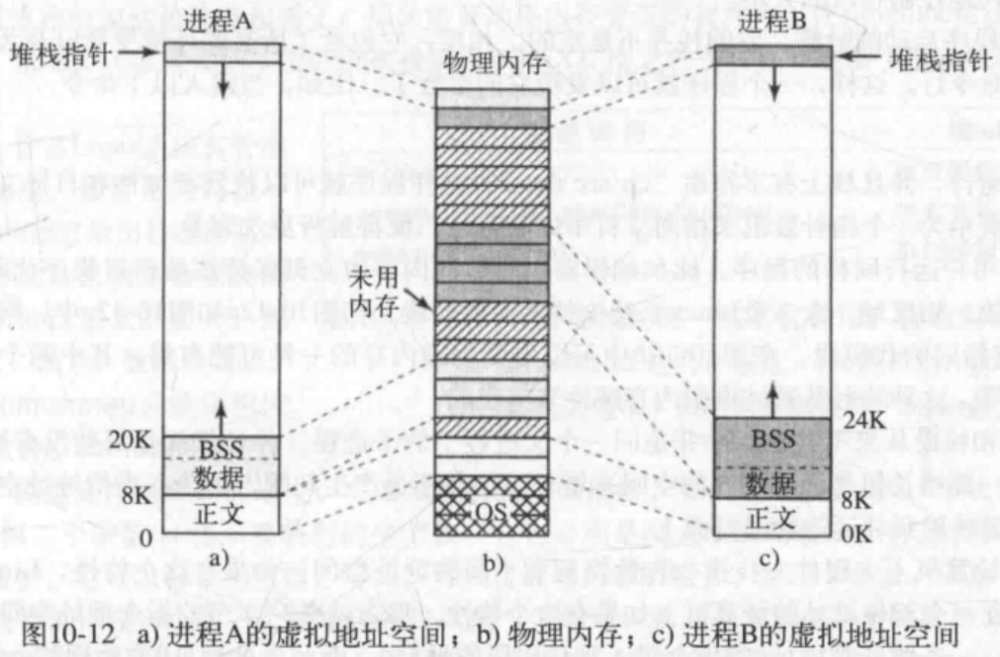

# 第三章 内存管理

### 3.2.2 交换技术
即把一个进程完整调入内存，使该进程运行一段时间，然后把它存回磁盘
空闲的进程主要存储在磁盘上（从而不占用内存）
当进程重新从磁盘回到内存时，需要通过硬件（多数情况）对其地址进行重定位
交换操作会在内存中产生了多个空闲区，如果把所有进程尽可能向低地址移动，可能可以把小的空闲区合成一大块（`内存紧缩技术`，耗费大量CPU时间）

#### 进程的内存分配
如果创建或者换入时，进程的大小是固定的且不变，则操作系统准确地按需分配即可
但如果进程的数据段可以增长：存在对堆区的动态内存分配，对应的策略可能是：预分配大的空间，但是换出的时候应该只交换进程实际上使用的内存空间（把额外空间也换出去是一种浪费）
如果内存空间实在不够用，则移动到足够大的空闲区，或者挂起。
以上足以可见，虚拟内存策略的优势。

### 3.3 虚拟内存
程序所占据的空间大于内存空间是常态
- 虚拟内存：
每个程序都有自己的地址空间，这个空间被分割成多个块，每个块被称作（页，page），每一页有连续的地址范围。这些页被映射到物理内存。不是所有的页都在内存里才能运行程序。
**当程序引用到一部分在物理内存中的地址空间时，由硬件执行必要的映射。**
**当程序引用到一部分不在物理内存中的地址空间时，由操作系统负责将缺失的部分装入物理内存并重新执行失败的指令**。

### 3.3.1 分页

当程序访问了一个未映射的页面
```
MOV REG, 32780
```
该指令位于虚拟页面8，32780是虚拟地址，其存储在虚拟页面8所在空间开始的第12个字节。
MMU注意到该页面并未因映射，`使得CPU陷入操作系统`，即`缺页中断`（page fault）。于是操作系统找到一个很少使用的页框把它的内容写入磁盘，随后把需要访问的页读到刚才回收的页框中，修改映射关系，然后重新启动引起陷阱的指令。


# 第十章 UNIX

### 10.3.4 Linux中的调度
**Linux系统的线程是内核线程，所以Linux系统的调度是基于线程的，而不是基于进程的**


### 10.3.5 启动Linux系统
1. BIOS加电自检（POST），对硬件进行检测和初始化（因为OS的启动可能依赖于磁盘访问、屏幕、键盘等硬件设备）

2. 启动磁盘的**第一个扇区**（主引导记录MBR），被读取到固定的内存区域，运行，
在主引导记录中，有一个很小的程序（只有512字节），运行时从启动设备（如SATA磁盘、SCSI磁盘）调入一个名为**boot**的独立程序，它将自己复制到高地址的内存，**释放低地址的内存**
复制完毕，boot程序**读取启动设备的根目录**，那就必须理解文件系统和目录格式，这个工作交由**引导程序**（如GRUB：多系统启动管理器来完成）
Intel的LILO引导程序不依赖于任何特定的文件系统，而是需要一个块映射图和低层地址，从而找到需要被加载的扇区
然后boot**读入操作系统内核，把控制交给内核**，系统内核从此开始运行。
内核的启动代码是用和平台相关的汇编写成的，主要工作：创建内核堆栈、识别CPU类型、计算可用内存、禁用中断、启动内存管理单元
然后开始执行操作系统的主要部分（C语言写的），分配内核数据结构（大部分的大小是固定的，但是比如页面缓存和特殊的页表结构是依赖于可用内存的大小）
然后系统开始自动配置，探测哪些设备确实存在，如果被探测设备响应，该设备就被加入已连接设备。注意：Linux系统的设备驱动程序不需要静态链接至内核，而是可以被动态加载

当所有硬件都配置好了，就开始运行进程0，建立其堆栈，并运行，它做的都是初始化操作：
配置实时时钟、挂载根文件系统、创建init进程（进程1）、以及页面守护进程（进程2）

init进程会检测标志以确定是为单用户还是多用户服务。
    对于单用户，init进程调用fork函数创建一个shell进程，并等待其结束
    对于多用户，init进程调用fork函数创建一个运行系统初始化shell脚本（/etc/rc）的进程：可以进行文件系统一致性检测、挂载附加文件系统、开启守护进程，然后从/etc/ttys中（记录所有的终端和他们的属性）读取数据，对于每一个启用的终端，这个进程调用fork函数创建一个自身的副本，进行内部处理，并运行一个名为getty的程序（为每条连线设置传输速率和其他属性），然后终端的屏幕上输出：login:，等待用户从键盘输入用户名，输入后，登录程序/bin/login开始运行（getty被login程序替换），它要求用户输入密码，并把密码加密，与保存在密码文件/etc/passwd的加密密码对比，如果正确，login程序就以用户shell程序替换自身，等待第一个命令
    当用户输入cp f1 f2命令时，shell程序调用fork创建一个子进程，并使得这个子进程运行cp程序，然后shell程序被阻塞，等待子进程结束


## 10.4 Linux中的内存管理
每个Linux进程都有一个地址空间，逻辑上分为三段：
`代码段`、
`数据段`、
`堆栈段`



### 代码段
包含形成可执行代码的机器指令，由编译器和汇编器产生，代码段是`只读的`

### 数据段
`数据段`包含了所有`程序变量`、`字符串`、`数字`和`其他数据的存储`。
它有两部分，
* `初始化数据`
* `未初始化数据`
(取决于代码中是否进行初始化)

由于历史的原因，后者就是我们所知道的`BSS`(历史上称作符号起始块)。
数据段的初始化部分包括编译器常量和那些在程序启动时就需要一个初始值的变量。
所有`BSS部分`中的`变量`在加载后被`初始化为0`。
例如，在`C语言`中可以在声明一个`字符串`的同时初始化它。
当程序启动的时候，字符串要拥有其初始值。
为了实现这种构造，编译器在地址空间给字符串分配一个位置，同时保证在程序启动的时候该位置包含了合适的字符串。
从操作系统的角度来看，初始化数据跟程序代码并没有什么不同一一二者都包含了由编译器产出的位串，它们必须在程序启动的时候加载到内存。
未初始化数据的存在实际上仅仅是个优化。
如果一个全局变量未显式地初始化，那么C语言的语义说明它的初始值是0。
实际上，大部分全局变量并没有显式初始化，因此都是0。
这些可以简单地通过设置可执行文件的一个段来实现，其大小刚好等于数据所需的字节数，同时初始化包括缺省值为零的所有量。
然而，为了节省可执行文件的空间，并没有这样做。
取而代之的是，跟随在程序代码之后，文件包含所有显式初始化的变量。
那些未初始化的变量都被收集在初始化数据之后，因此`编译器要做的就是在文件头部放入一个字段说明要分配的字节数`。
为了清楚地说明这一点，再考虑图10-12a。

这里代码段的大小是8KB，`初始化数据段`的大小也是8KB。未初始化数据(BSS)是4KB。
可执行文件仅有16KB(代码 + 初始化数据)加上一个`很短的头部`来告诉系统在初始化数据后另外再分配4KB，同时在程序启动之前把它们初始化为0。
`这个技巧避免了在可执行文件中存储4KB的0（也就是说，在程序被加载到内存才分配空间）`。

为了避免分配一个全是0的物理页框，在初始化的时候，Linux就分配了一个静态零页面，即一个全0的写保护页面。
当加载程序的时候，未初始化数据区域被设置为指向该零页面。
当一个进程真正要写这个区域的时候，`写时复制`的机制就开始起作用，一个实际的页框被分配给该进程。
`跟代码段不一样，数据段可以改变`。程序总是修改它的变量。
而且，许多程序需要在执行时动态分配空间。
Linux允许数据段随着内存的分配和回收而增长和缩减，通过这种机制来解决`动态分配`的问题。
有一个`系统调用brk`，允许程序设置其`数据段`的大小（或者说，`堆空间`）。
那么，为了分配更多的内存，一个程序可以增加数据段的大小。
C库函数`malloc`通常被用来分配内存，它就大量使用这个系统调用。
进程地址空间描述符包含信息:进程动态分配的内存区域(通常叫作堆，heap)的范围。

### 栈段
在大多数机器里，它从虚拟地址空间的顶部或者附近开始，并且向低地址空间延伸例如，在32位x86平台上，栈的起始地址是0XC0000000，这是在用户态下对进程可见的3GB虚拟地址限制。
如果栈生长到了栈段的底部以下，就会产出一个`硬件错误`同时操作系统把栈段的底部降低一个页面，程序并不显式地控制栈段的大小。
当一个程序启动的时候，它的栈并不是空的。
相反，它包含了所有的`环境变量`以及为了调用它而向shell输入的`命令行`。
这样，一个程序就可以发现它的参数了。比如，当输入以下命令
```sh
cp src dest
```
cp程序运行，并且栈上有字符串“cp src dest”，这样程序就可以找到`源文件`和`目标文件`的名字。
这些字符串被表示为一个指针数组来指向字符串中的符号，使得解析更加容易。
当两个用户运行同样的程序，比如编辑器，可以在内存中立刻保持该编辑器程序代码的两个副本，但是并不高效。
相反地，大多数Linux系统支持`共享代码段`。
在图10-12a和图10-12中，可以看到两个进程A和B拥有相同的代码段。在图10-12b中可以看到物理内存的一种可能布局，其中两个进程共享了同样的代码片段。这种映射是通过`虚拟内存硬件`来实现的。
`数据段`和`栈段`从来不共享，除非是`同一个父进程下的子进程`，并且仅仅是那些没有被修改的页面
如果二者之一要增长但是没有邻近的空间来增长，这并不会产生问题，因为在虚拟地址空间中邻近的页面并不一定要映射到邻近的物理页面上。

把一个文件映射进来的一个附加的好处是两个或者更多的进程可以同时映射相同的文件。
其中一个进程对文件的写可以被其他进程马上看到。实际上，通过映射一个临时文件(所有的进程退出之后就被丢弃)，这种机制可以为多进程共享内存提供高带宽。
在最极限的情况下，两个(或者更多) 进程可以映射一个文件覆盖整个地址空间，从而提供了一种不同进程之间和线程之间的共享方式。
这样地址空间是共享的(类似于线程)，但是每个进程维护其自身的打开文件和信号，这些不同于线程。
实际上，从来没有两个完全相同的地址空间。

### 10.4.2 Linux中的内存管理系统调用
POSIX没有给内存管理指定任何系统调用。


