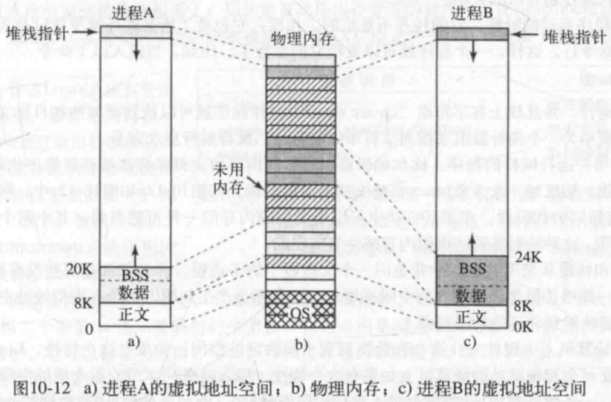

# 第三章 内存管理

### 3.2.2 交换技术
即把一个进程完整调入内存，使该进程运行一段时间，然后把它存回磁盘
空闲的进程主要存储在磁盘上（从而不占用内存）
当进程重新从磁盘回到内存时，需要通过硬件（多数情况）对其地址进行重定位
交换操作会在内存中产生了多个空闲区，如果把所有进程尽可能向低地址移动，可能可以把小的空闲区合成一大块（`内存紧缩技术`，耗费大量CPU时间）

#### 进程的内存分配
如果创建或者换入时，进程的大小是固定的且不变，则操作系统准确地按需分配即可
但如果进程的数据段可以增长：存在对堆区的动态内存分配，对应的策略可能是：预分配大的空间，但是换出的时候应该只交换进程实际上使用的内存空间（把额外空间也换出去是一种浪费）
如果内存空间实在不够用，则移动到足够大的空闲区，或者挂起。
以上足以可见，虚拟内存策略的优势。

### 3.3 虚拟内存
程序所占据的空间大于内存空间是常态
- 虚拟内存：
每个程序都有自己的地址空间，这个空间被分割成多个块，每个块被称作（页，page），每一页有连续的地址范围。这些页被映射到物理内存。不是所有的页都在内存里才能运行程序。
**当程序引用到一部分在物理内存中的地址空间时，由硬件执行必要的映射。**
**当程序引用到一部分不在物理内存中的地址空间时，由操作系统负责将缺失的部分装入物理内存并重新执行失败的指令**。

### 3.3.1 分页

当程序访问了一个未映射的页面
```
MOV REG, 32780
```
该指令位于虚拟页面8，32780是虚拟地址，其存储在虚拟页面8所在空间开始的第12个字节。
MMU注意到该页面并未因映射，`使得CPU陷入操作系统`，即`缺页中断`（page fault）。于是操作系统找到一个很少使用的页框把它的内容写入磁盘，随后把需要访问的页读到刚才回收的页框中，修改映射关系，然后重新启动引起陷阱的指令。


# 第十章 UNIX

### 10.3.4 Linux中的调度
**Linux系统的线程是内核线程，所以Linux系统的调度是基于线程的，而不是基于进程的**


### 10.3.5 启动Linux系统
1. BIOS加电自检（POST），对硬件进行检测和初始化（因为OS的启动可能依赖于磁盘访问、屏幕、键盘等硬件设备）

2. 启动磁盘的**第一个扇区**（主引导记录MBR），被读取到固定的内存区域，运行，
在主引导记录中，有一个很小的程序（只有512字节），运行时从启动设备（如SATA磁盘、SCSI磁盘）调入一个名为**boot**的独立程序，它将自己复制到高地址的内存，**释放低地址的内存**
复制完毕，boot程序**读取启动设备的根目录**，那就必须理解文件系统和目录格式，这个工作交由**引导程序**（如GRUB：多系统启动管理器来完成）
Intel的LILO引导程序不依赖于任何特定的文件系统，而是需要一个块映射图和低层地址，从而找到需要被加载的扇区
然后boot**读入操作系统内核，把控制交给内核**，系统内核从此开始运行。
内核的启动代码是用和平台相关的汇编写成的，主要工作：创建内核堆栈、识别CPU类型、计算可用内存、禁用中断、启动内存管理单元
然后开始执行操作系统的主要部分（C语言写的），分配内核数据结构（大部分的大小是固定的，但是比如页面缓存和特殊的页表结构是依赖于可用内存的大小）
然后系统开始自动配置，探测哪些设备确实存在，如果被探测设备响应，该设备就被加入已连接设备。注意：Linux系统的设备驱动程序不需要静态链接至内核，而是可以被动态加载

当所有硬件都配置好了，就开始运行进程0，建立其堆栈，并运行，它做的都是初始化操作：
配置实时时钟、挂载根文件系统、创建init进程（进程1）、以及页面守护进程（进程2）

init进程会检测标志以确定是为单用户还是多用户服务。
    对于单用户，init进程调用fork函数创建一个shell进程，并等待其结束
    对于多用户，init进程调用fork函数创建一个运行系统初始化shell脚本（/etc/rc）的进程：可以进行文件系统一致性检测、挂载附加文件系统、开启守护进程，然后从/etc/ttys中（记录所有的终端和他们的属性）读取数据，对于每一个启用的终端，这个进程调用fork函数创建一个自身的副本，进行内部处理，并运行一个名为getty的程序（为每条连线设置传输速率和其他属性），然后终端的屏幕上输出：login:，等待用户从键盘输入用户名，输入后，登录程序/bin/login开始运行（getty被login程序替换），它要求用户输入密码，并把密码加密，与保存在密码文件/etc/passwd的加密密码对比，如果正确，login程序就以用户shell程序替换自身，等待第一个命令
    当用户输入cp f1 f2命令时，shell程序调用fork创建一个子进程，并使得这个子进程运行cp程序，然后shell程序被阻塞，等待子进程结束


## 10.4 Linux中的内存管理
每个Linux进程都有一个地址空间，逻辑上分为三段：代码段、数据段、堆栈段



### 代码段
包含形成可执行代码的机器指令，由编译器和汇编器产生，代码段是只读的


