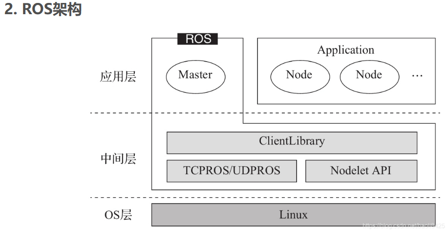
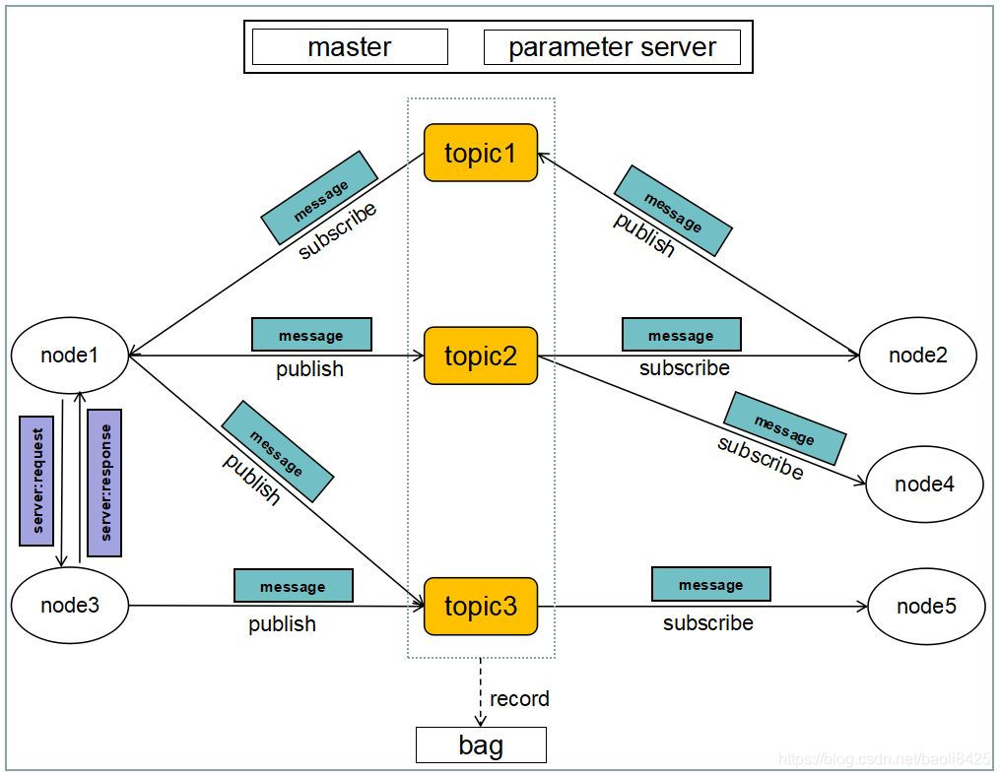

# 
# ROS基本概念
***Robot Operating System***，即机器人操作系统
ROS是一个适用于机器人的开源的**元操作系统**。它提供了**操作系统应有的服务**：包括硬件抽象，底层设备控制，常用函数的实现，进程间消息传递，以及包管理。
它也提供用于获取、编译、编写、和跨计算机运行代码所需的工具和库函数。
它的目的是为了提高机器人研发中的软件复用率，简化跨机器人平台创建复杂、鲁棒的机器人行为这一过程的难度与复杂度。

# ROS架构

## 2.1 OS层
毕竟不是Windows、Linux那种传统意义上的操作系统，无法直接运行在计算机硬件上，而是依赖于Linux系统

## 2.2 中间层
Linux系统本身没有针对机器人开发的中间件，因此ROS在中间层做了大量工作。
首先是基于TCP/UDP网络，并在此之上进一步封装而构建的**TCPROS/UDPROS通信系统**。
另外ROS还提供了一种进程内的通信方法——Nodelet，为多进程通信提供了一种更为优化的数据传输方式。
在通信机制之上，ROS提供了大量机器人开发的库，以提供给应用层调用。

## 2.3 应用层
应用层中ROS需要一个管理者，即**Master**，负责管理整个系统正常运行，为Node之间建立连接。

# 3 通信机制
ROS采用的是一种点对点的分布式通信机制，实现模块间点对点的松耦合连接，所有软件功能及工具都建立在这种通信机制上，为用户提供多节点（多进程）的通信服务。
ROS最为核心的三种：
1. Topic通信机制
2. Service通信机制
3. Parameter参数管理机制

# 4 计算图
ROS系统的功能模块以节点为单位单独运行，可以分布于多个不同或相同的主机中，通过端对端的拓扑结构相连接。

PS：ROS中存在着parameter server这么一个APP

## 4.1 节点（Node）
节点就是执行具体任务的进程或独立运行的可执行文件，通常一个系统由多个节点组成，节点之间可以通过ROS客户端库（如roscpp 、rospy）相互通信。
**不同节点可使用不同编程语言，可分布式运行在不同的主机**。**节点在系统中的名称必须是唯一的**。

## 4.2 节点管理器（Master）
节点管理器在系统中主要起到了一个中介的作用，能够帮助节点相互找到彼此。节点管理器能够为节点提供命名和注册服务，以及跟踪和记录话题/服务通信。同时节点管理器还提供了一个参数服务器（**Parameter Server**），节点使用此服务器存储和检索运行时的参数。

## 4.3 消息（Message）
消息本身是基于发布/订阅模型的话题通信机制而来的，具有一定的类型和数据结构，既包含ROS提供的标准数据类型，也可由用户自定义数据类型。

## 4.4 Topic
话题通信采用的是一种**异步通信机制**。
话题通信基于**发布/订阅模型**，数据由发布者传输给订阅者。其中节点既可以作为发布者发布消息，也可以作为订阅者订阅消息。同一个话题的发布者和订阅者可以不唯一，另外一个节点也可以发布或订阅多个消息。
一般来说，发布者和订阅者并不知道对方的存在。发布者将信息发布在一个全局的工作区内，当订阅者发现该信息是它所订阅的，就可以接收到这个信息。通常用于数据传输。

## 4.5 服务（Service）
服务通信采用的是一种**同步通信机制**。服务通信基于**客户端/服务器模型**，客户端（Client）发送请求数据（Request），服务器（Server）完成处理后返回应答数据（Response）。与话题不同的是，ROS中只允许有一个节点提供指定命名的服务。通常用于逻辑处理。

## 4.6 动作（Action）
**动作**是基于ROS消息机制实现的一种**问答通信机制**，基于客户端/服务器模型，服务器可以连续反馈数据给客户端，客户端可以在任务运行过程中中止运行。
动作Action的接口主要由goal、cancel、status、feedback和result组成，客户端可以在任务启动前向服务器发布任务目标goal，也可以在任务过程中向服务器发送cancel请求取消任务。服务器向客户端反馈服务器当前的状态，或周期性反馈任务运行的监控数据，而result在任务运行过程中只发布一次，仅在服务器完成动作后反馈一个最终结果。

## 4.7 消息记录包（ROS Bag）
**ROS Bag是一种用于保存和回放ROS消息数据的文件格式**。
它使用.bag格式**保存消息、主题、服务和其他ROS数据信息**，可以在事件发生后，通过使用可视化工具调用和回放数据，检查在系统中到底发生了什么。记录包文件可以像实时会话一样在ROS中再现情景，在相同时间向主题发送相同的数据。通常用于调试算法。

## 4.8 参数（Parameter）
Parameter Server能够保存一部分参数作为全局共享字典，**系统中的所有节点都可以通过网络访问这些共享字典**，存储和检索参数的参数名或参数值，而字典中的数据类型包含了int整型、float浮点型、string字符串等。参数的存储和检索采用的通信机制是更为底层的RPC，而不再是话题或服务。它更适合存储静态、非二进制的配置参数，不适合存储动态配置的数据。

## 4.9 功能包（Package）
功能包是ROS软件中的基本单元，包含节点源码、配置文件、数据定义等。

## 4.10 功能包清单（Package manifest）
功能包清单记录了功能包的基本信息，包含作者信息、许可信息、依赖选项、编译标志等。

## 4.11 元功能包（Meta Package）
元功能包是一种特殊的功能包，它只包含元功能包清单文件。它的作用是将多个具有相同功能的功能包整合成一个逻辑上独立的功能包，类似于功能包集合。