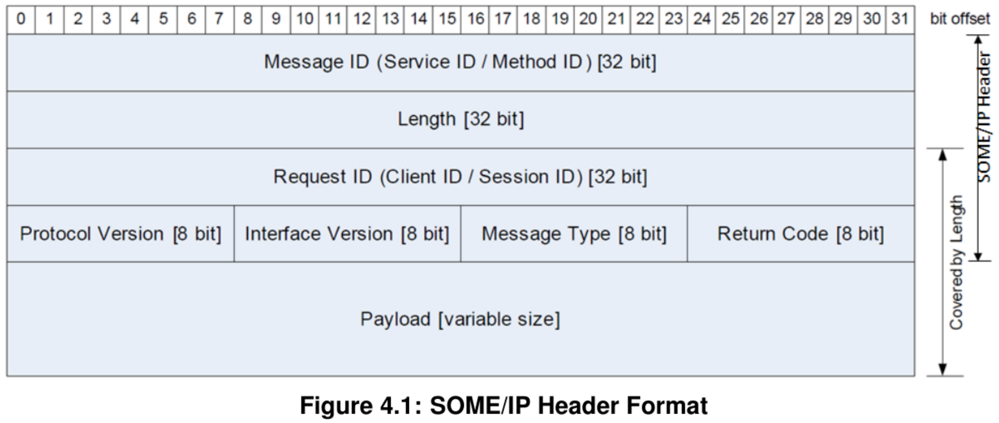
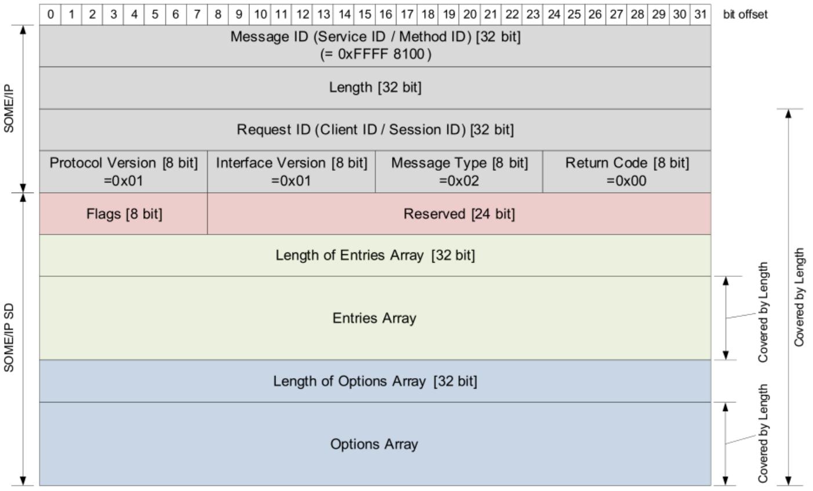

# 协议规范
## service的内容：
**Events** provide data that are sent cyclically or on change from the provider to the subscriber.
**Methods** provide the possibility to the subscriber to issue remote procedure calls which are executed on provider side.
**Fields** are combinations of one or more of the following three：
1. a notifier which sends data on change from the provider to the subscribers
2. a getter which can be called by the subscriber to explicitly query the provider for the value
3. a setter which can be called by the subscriber when it wants to change the value on provider side
The major difference between the notifier of a field and an event is that events are **only sent on change**, the notifier of a field additionally sends the data directly after subscription.

## SOME/IP Message Format

## SOME/IP-SD
SOME/IP-SD is used to
1. Locate **service instances**.
2. Detect if service instances are running.
3. Implement the Publish/Subscribe handling.

**在车载网络中，服务实例的位置通常是已知的；因此，服务实例的状态是首要关注点。服务的位置（即 IP 地址、传输协议和端口号）则是次要问题。**

如果需要在多个接口上提供服务实例，每个接口应使用单独的服务器服务实例。
如果服务实例需要配置为使用多个不同接口访问，则每个接口应使用单独的客户服务实例。

就是在SOME/IP Message Format的Payload中塞入以下字段：

